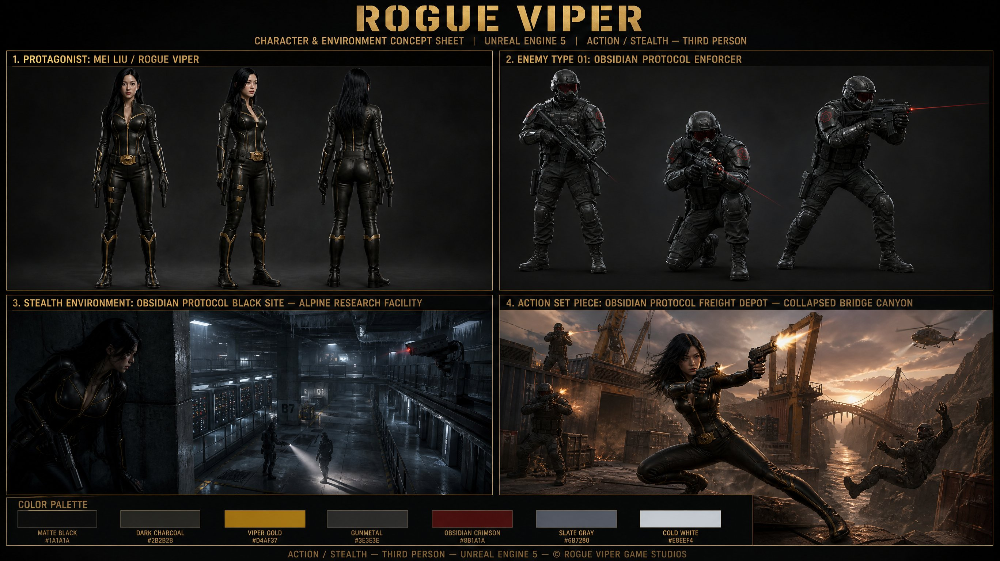

# GPT-Image2 Game Production Library

Use this skill to turn a game-development intent into a production-ready GPT-Image2 prompt using this fork's game-focused deliverable template library.

## Example Output

Example request: `Use gpt-image-2-game-style-library to create a mobile RPG UI panel slicing sheet prompt.`

## Reference

- Read `references/style-library.md` before choosing a template, tag, or category.
- The reference is generated from `data/style-library.json` in the repository.
- Prefer the reference over memory when template names, deliverable categories, tags, downstream contexts, or pitfalls matter.

## Workflow

1. Detect the user's language and answer in that language.
2. Identify the requested game deliverable: character production sheet, sprite animation sheet, UI panel slicing sheet, icon atlas, tilemap atlas, environment layout sheet, prop/equipment turnaround, VFX sequence sheet, monster combat readability sheet, building upgrade set, store asset pack, or art style guide.
3. Identify the downstream owner: concept artist, UI artist, animator, modeler, technical artist, combat designer, level designer, engine integrator, marketing artist, art director, or outsource vendor.
4. Identify production context: engine-ready import, concept-to-production handoff, Unity, Cocos, mobile, PC, combat, level design, localization, marketing, RPG, strategy, survival, live ops, or another project-specific context.
5. Match the request in this order: deliverable category, downstream owner, production context, style/tag constraints, then nearest example cases.
6. If one template is clearly strongest, use it directly. If several are plausible, present 2-3 options with short tradeoffs and ask the user to choose.
7. Build the final prompt with these blocks:
   - production owner and downstream use
   - source brief, game system role, and asset family
   - output format, layout, camera, grid, slice, atlas, frame, or crop rules
   - art direction, materials, palette, readability, and platform constraints
   - acceptance checks for import, slicing, consistency, small-size readability, or marketing crop safety
   - negative constraints and common failure modes
8. Include the selected template name and any useful example case IDs.

## Output Defaults

- Provide a copyable prompt first.
- Keep constraints concrete: exact deliverable type, downstream user, aspect ratio or grid/frame format, camera, background rule, text/localization rule, and production-use requirement.
- For Chinese requests, write the final prompt in Chinese unless the user asks for English.
- For English requests, write the final prompt in English unless the user asks for Chinese.
- When the user asks for multiple variants, reuse one template and vary gameplay role, faction, palette, silhouette, asset function, and acceptance checks.
- For production assets, favor clean backgrounds, consistent lighting, stable scale, readable silhouettes, and extraction-friendly layouts over decorative scene complexity.
- For UI, atlas, sprite, tilemap, and VFX requests, explicitly mention slicing/import constraints.
- For marketing assets, include crop-safe areas, logo-safe space, localization space, and the honest gameplay promise.

## Maintenance

When the source library changes, run:

~~~bash
npm run generate:style-skill
~~~

To install the skill into local agent skill folders, run:

~~~bash
npm run install:skill codex
~~~
